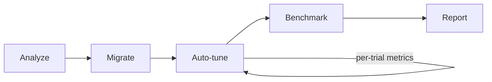
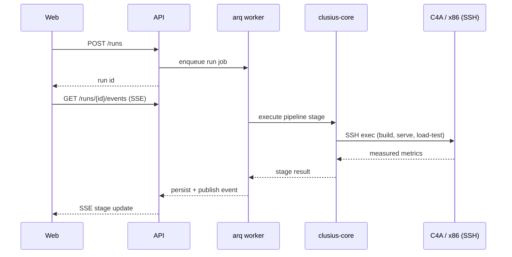

# Architecture

## Overview

Clusius is a monorepo of four packages plus supporting infra:

- **`packages/core`** (`clusius-core`) — the engine. Pure Python, no web framework
  dependency. Implements the five pipeline stages (analyze, migrate, tune, bench,
  report) and the GCP provisioning layer.
- **`packages/api`** (`clusius-api`) — a FastAPI service that owns persistence
  (Postgres via SQLAlchemy/Alembic) and orchestrates pipeline runs as background jobs
  (arq/Redis), streaming progress over SSE.
- **`packages/agent`** (`clusius-agent`) — the showcase multi-model RAG/MCP agent that
  serves as the workload Clusius migrates. Exposes an OpenAI-compatible endpoint.
- **`packages/web`** (`clusius-web`) — the Next.js dashboard. Talks only to the API
  (REST + SSE), never touches the database directly.

## Pipeline flow

## Request / data flow

## Backend selection

Clusius builds and probes two Arm-optimized serving backends for every migration:

- **llama.cpp + KleidiAI** — GGUF quantization, CPU matmul kernels accelerated by
  KleidiAI on Armv9 (Neoverse V2 / C4A), favored for low-concurrency / single-stream
  workloads.
- **vLLM + oneDNN + Arm Compute Library** — INT4 weight quantization, continuous
  batching, favored for high-concurrency batched throughput.

The tuner probes both on a sample of the run's actual traffic profile and picks the
winner subject to the accuracy floor and latency SLA, recording the justification in the
generated migration report.

## Data model

Entities: `Run`, `Trial`, `Result`, `Artifact`, `Workload`. See
[`packages/api/clusius_api/db`](packages/api/clusius_api/db) for the SQLAlchemy models.

## Provisioning modes

- **Target mode** (default): SSH into an existing C4A + x86 pair. No cloud credentials
  held by Clusius.
- **Provisioned mode** (opt-in): Clusius creates the instance pair via
  `google-cloud-compute`, enforcing a cost ceiling and TTL auto-teardown, always torn
  down in a `finally` block.
