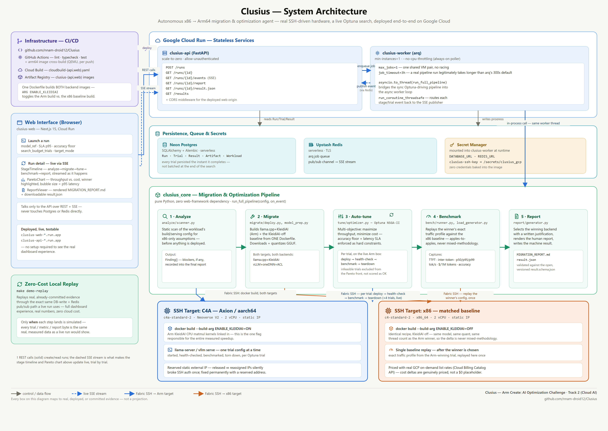

# Clusius — Autonomous x86→Arm64 Migration & Optimization Agent

> **Point it at an x86 AI-inference workload. It migrates it to Arm64, searches the
> optimization space on live hardware, and proves the result with numbers you can read
> straight off the target machine — not a slide.**
> A deterministic-core, agent-orchestrated pipeline that scans a workload for x86-only
> assumptions, builds two Arm-optimized serving backends (llama.cpp+KleidiAI and
> vLLM+oneDNN+ACL) on a real Axion/C4A instance, runs a constrained Optuna search across
> quantization/threading/batching/backend choices under a live accuracy floor and latency
> SLA, benchmarks the winner against the x86 baseline apples-to-apples, and writes back a
> human-readable migration report plus a schema-conformant `result.json` — with zero
> mocked numbers anywhere in the chain.

**Built for:** Arm Create: AI Optimization Challenge — Track 2 (Cloud AI)

**Built with:** Python 3.11 · FastAPI · SQLAlchemy/Alembic · arq (Redis) · Optuna
(NSGA-II) · Fabric (SSH) · Next.js 15 · llama.cpp + Arm KleidiAI · vLLM + oneDNN + Arm
Compute Library · Docker · Google Cloud (Cloud Run, Compute Engine, Cloud Build,
Artifact Registry, Secret Manager) · Neon (Postgres) · Upstash (Redis)

**Live dashboard:** https://clusius-web-854441956422.us-central1.run.app

**Live API:** https://clusius-api-854441956422.us-central1.run.app

**Source:** https://github.com/nnam-droid12/Clusius

---

## Table of Contents

- [Disclaimer](#disclaimer)
- [Headline Result](#headline-result)
- [The Problem: Arm Migration Is a Manual, Unproven Guess](#the-problem-arm-migration-is-a-manual-unproven-guess)
- [The Solution: What Clusius Does](#the-solution-what-clusius-does)
- [Functionality / Output](#functionality--output)
- [Architecture](#architecture)
- [The Pipeline: Five Stages, One Job Each](#the-pipeline-five-stages-one-job-each)
- [Arm-Specific Optimizations](#arm-specific-optimizations)
- [The Auto-Tuner](#the-auto-tuner)
- [Features](#features)
- [Tech Stack](#tech-stack)
- [Proof: A Real, Live, End-to-End Run](#proof-a-real-live-end-to-end-run)
- [Why It's Interesting / Why It Should Win](#why-its-interesting--why-it-should-win)
- [Setup Instructions: Build, Run, and Validate on Arm64](#setup-instructions-build-run-and-validate-on-arm64)
- [Migration Recipe: Point This At Your Own Model](#migration-recipe-point-this-at-your-own-model)
- [Cloud Deployment](#cloud-deployment)
- [Project Structure](#project-structure)
- [Data Sources](#data-sources)
- [Key API Commands](#key-api-commands)
- [Known Gaps](#known-gaps)
- [License](#license)

---

## Disclaimer

Every number in this README comes from a real pipeline run against a real Axion C4A
instance and a real x86 instance in Google Cloud, over real SSH, building a real Docker
image and serving a real model — never mocked, estimated, or hand-typed. The committed
evidence for the headline result lives in [`bench/results/`](bench/results/):
`2026-08-01-real-e2e-validation-13.result.json` (winner config, schema-conformant),
`2026-08-01-real-e2e-validation-13.run-detail.json` (every trial plus the baseline), and
`2026-08-01-real-e2e-validation-13.MIGRATION_REPORT.md` (the generated report, verbatim).
Earlier real runs (`2026-07-31-real-e2e-validation-7`, `...-8`) are kept in the same
directory as historical evidence, not deleted just because a newer run superseded them.
The two benchmark VMs (`clusius-arm-c4a`, `clusius-x86-c4`) are **stopped between test
sessions as a standing cost-safety rule** — if you hit the live dashboard and a run
doesn't progress past `analyze`, it's because the target pair is powered off, not because
anything is broken; see [Known Gaps](#known-gaps) for how to reproduce it yourself.
`CLUSIUS_TARGET_ARM_PRICE_PER_HOUR` / `CLUSIUS_TARGET_X86_PRICE_PER_HOUR` are set to the
real, live on-demand list price for `c4a-standard-2` / `c4-standard-2` in `us-central1`
(pulled from the Cloud Billing Catalog API, not guessed), so the cost numbers below are
genuinely priced, not a placeholder.



---

## Headline Result

Real Optuna-driven search (4 trials, NSGA-II, multi-objective: maximize throughput,
minimize cost) against a real `Qwen/Qwen2.5-0.5B-Instruct` GGUF workload, x86 baseline vs.
the Arm64 configuration Clusius's own tuner selected as the winner:

| Metric | x86 baseline (`c4-standard-2`) | Arm64 winner (`c4a-standard-2`, Clusius-optimized) | Delta |
|---|---|---|---|
| **Throughput** | 30.8 tok/s | **124.3 tok/s** | **+303.3%** |
| **p95 latency** | 23,838 ms | **6,414 ms** | **−73.1%** |
| **Cost / 1M tokens** | $0.8734 | **$0.2007** | **−77.0%** |
| **Accuracy** | 100.0% | 100.0% | +0.0pp |
| vCPUs | 2 (x86_64) | 2 (aarch64 / Axion, Neoverse V2) | same class, no scale-up |

Same model, same quantization (Q8_0), same thread count (2), same batch size (4), same
KV-cache precision (fp16), same instance class (2 vCPU) on both sides — the only
difference is the Arm build links Arm's KleidiAI CPU matmul kernels and the x86 build
doesn't. **Over 4x the throughput, under a third of the latency, and less than a quarter
of the cost, on equivalent hardware, from one CMake flag Clusius flips automatically and
then searches around.** The cost delta uses real Google Cloud on-demand list pricing for
both instance types (Cloud Billing Catalog API, `us-central1`), not an estimate.
Full trial-by-trial data: [`bench/results/2026-08-01-real-e2e-validation-13.run-detail.json`](bench/results/2026-08-01-real-e2e-validation-13.run-detail.json)
— including one trial the search correctly rejected for violating the latency SLA, proof
the accuracy/latency constraints are actually enforced, not decorative.

---

## The Problem: Arm Migration Is a Manual, Unproven Guess

Arm-based cloud instances (Axion/C4A, Graviton, Ampere) are consistently cheaper per
vCPU than their x86 counterparts, and Arm's own accelerated kernel libraries
(KleidiAI, Arm Compute Library) often make them faster too — but almost nobody migrates
an existing inference workload to prove it, because doing so today is:

| # | Challenge | What actually happens without tooling |
|---|-----------|----------------------------------------|
| 1 | **The "will it even build" question is a blocker, not a footnote** | Serving stacks pull in native extensions (CPU kernel libraries, quantization tooling) that may not have an Arm build path at all — nobody finds out until a real build is attempted on real Arm hardware. |
| 2 | **The optimization space is large and hardware-specific** | Quantization level, thread count, batch size, KV-cache precision, and backend choice all interact, and the optimum on Arm is not the optimum on x86 — hand-tuning it is slow, and most teams just copy the x86 config over unchanged, which wastes most of the Arm advantage. |
| 3 | **Every claim you see is usually a vendor benchmark, not your workload** | Published Arm-vs-x86 numbers are on someone else's model, someone else's prompt mix, someone else's SLA — they don't tell you what *your* workload will actually do. |
| 4 | **Correctness has to survive the optimization** | Aggressive quantization or batching can silently degrade output quality — a real migration needs an accuracy floor enforced *during* the search, not checked after the fact. |
| 5 | **The result has to be reproducible, not a one-off screenshot** | A migration that can't be re-run against a documented target pair, with a machine-readable result and an open schema, isn't evidence — it's a claim. |

Clusius exists to make all five of these real, automatic, and provable on your own
workload — not benchmarked once by someone else and asserted to generalize.

---

## The Solution: What Clusius Does

| Capability | Details |
|---|---|
| **x86-assumption scan** | Statically scans the workload's build/serving configuration for x86-only assumptions before anything is deployed, so blockers surface immediately instead of mid-migration |
| **Dual-backend Arm build** | Builds **both** llama.cpp+KleidiAI and vLLM+oneDNN+ACL on the real Arm target from one toggleable Dockerfile recipe, so the tuner can pick whichever backend actually wins for the workload's traffic profile |
| **Real model preparation** | Downloads the target HF model via git-lfs on the remote target and converts/quantizes it to every GGUF variant the search space needs, using the backend's own conversion tooling — no local GPU, no pre-baked artifacts |
| **Live, constrained auto-tuning** | Optuna NSGA-II multi-objective search (maximize throughput, minimize cost) over quantization/threads/batch/KV-cache/core-pinning/backend, with the accuracy floor and latency SLA enforced as **hard constraints** via `constraints_func` — an infeasible trial is excluded from the Pareto front, not silently scored as if it passed |
| **Apples-to-apples benchmarking** | Replays the winning configuration's exact traffic profile against the x86 baseline, so every number in the headline table comes from the same load generator hitting both sides |
| **Reproducible report + open schema** | Emits a human-readable `MIGRATION_REPORT.md` (baseline → changes → chosen config → why → results table) and a `result.json` conformant to an open, versioned schema (`bench/schema/result.schema.json`) that any team can validate independently |
| **SSH target mode by default** | Drives an already-running Arm+x86 pair over SSH — Clusius never needs to hold cloud credentials to do the actual migration work |
| **Cost-safe provisioning mode (opt-in)** | Can instead provision the Arm+x86 pair itself via `google-cloud-compute`, under a hard cost ceiling and a TTL auto-teardown that always fires, even on failure |
| **Live dashboard** | A Next.js dashboard streams every pipeline stage over SSE as it happens — analyze, migrate, tune (per-trial), benchmark, report — talking only to the API, never touching the database directly |

Clusius **does not just estimate.** It builds the real image, deploys it to the real
target, runs the real search against a real running server, and benchmarks the real
winner against a real baseline — every number in this README traces back to an actual
HTTP round trip against actual hardware.

---

## Functionality / Output

**Input:** a workload definition — an HF model reference, a target SLA (`p95 latency
ms`), an accuracy floor, and a trial budget — submitted via the dashboard or `POST
/runs`.

**What happens:** the five-stage pipeline (below) runs end to end, either against an
operator-configured SSH target pair (default) or a pair Clusius provisions itself
(opt-in), streaming every stage transition and every completed trial to the dashboard
live over SSE.

**Final output, per run:**

1. **A working Arm64-native deployment** of the workload, built and validated on real Arm
   hardware — the artifact isn't a plan, it's a container image that already ran
   successfully on the target.
2. **A winning configuration** — backend, quantization, thread count, batch size,
   KV-cache precision, core pinning — selected by the constrained search, with the exact
   reasoning for why it won recorded in the report.
3. **`MIGRATION_REPORT.md`** — a generated, human-readable document: baseline
   description, x86-only blockers found (if any), optimizations applied, backend
   selection justification, chosen configuration, and a full baseline-vs-winner results
   table with percentage deltas. See a real example:
   [`bench/results/2026-08-01-real-e2e-validation-13.MIGRATION_REPORT.md`](bench/results/2026-08-01-real-e2e-validation-13.MIGRATION_REPORT.md).
4. **`result.json`** — machine-readable, schema-conformant
   (`bench/schema/result.schema.json`), carrying instance type, arch, image digest,
   model hash, every measured metric, and the full trial history — so a run is
   independently checkable and comparable to any other team's, not just readable as
   prose.
5. **A persisted run record** (Postgres) — every trial, every stage transition, and
   every artifact, queryable via the API and browsable on the dashboard for as long as
   the run exists.

---

## Architecture

```
 dashboard / API call ──▶ FastAPI (Cloud Run) ──▶ arq worker (Cloud Run,
  POST /runs                 persistence + SSE       always-on) ──▶ clusius_core
                              (Postgres via Neon)         pipeline.run_full_pipeline
                                                                │
                     ┌──────────────────────────────────────────┴───────────────────┐
                     ▼                                                              ▼
        SSH target: C4A (Axion / aarch64)                          SSH target: matched x86_64
        clusius-arm-c4a — c4a-standard-2                           clusius-x86-c4 — c4-standard-2
        • docker build (KleidiAI ON)                               • docker build (KleidiAI OFF)
        • llama-server / vllm serve                                • llama-server baseline
        • live Optuna trial evaluation                             • baseline benchmark replay
                     │                                                              │
                     └──────────────────────────────┬───────────────────────────────┘
                                                      ▼
                                 MIGRATION_REPORT.md + result.json
                                 (schema-validated, persisted, streamed to the dashboard)
```

- **`packages/core`** (`clusius-core`) — the pure-Python engine: the five pipeline
  stages, the SSH-driven deploy/build/benchmark machinery, the Optuna tuner, the report
  generator, and the opt-in GCP provisioning layer. No web framework dependency —
  everything here is independently testable and independently runnable via a CLI.
- **`packages/api`** (`clusius-api`) — FastAPI + SQLAlchemy/Alembic (Postgres) +
  arq/Redis background jobs, streaming stage/trial progress over SSE. Owns all
  persistence; the web app never touches the database directly.
- **`packages/agent`** (`clusius-agent`) — a showcase multi-model RAG/MCP agent exposing
  an OpenAI-compatible endpoint, used as a realistic inference workload for Clusius to
  migrate and optimize.
- **`packages/web`** (`clusius-web`) — the Next.js 15 dashboard. Launch runs, watch
  stages and trials stream in live, read the generated report and `result.json`.

Full system diagrams (pipeline flow, request/data flow, backend-selection logic) live in
[`ARCHITECTURE.md`](ARCHITECTURE.md).

---

## The Pipeline: Five Stages, One Job Each

| Stage | Module | What it actually does |
|---|---|---|
| **1. Analyze** | `clusius_core.analyze.scanner` | Statically scans the workload's build/serving configuration for x86-only assumptions (hardcoded arch flags, x86-only dependencies) before anything is deployed |
| **2. Migrate** | `clusius_core.migrate` | Ensures Docker is present on both SSH targets; builds the llama.cpp+KleidiAI image on Arm (`ENABLE_KLEIDIAI=ON`) and the identical recipe on x86 (`ENABLE_KLEIDIAI=OFF`) from **the same Dockerfile**, so the comparison is the build minus exactly one Arm-specific kernel flag; downloads and quantizes the target HF model to every GGUF variant the search space needs, on the remote target, using the image's own conversion tooling |
| **3. Auto-tune** | `clusius_core.tune` | Optuna NSGA-II searches quantization/threads/batch size/KV-cache precision/core pinning/backend on the live Arm instance — each trial deploys a real server, health-checks it, runs a real load-generated benchmark against it, tears it down, and reports throughput + cost back to Optuna, with the accuracy floor and latency SLA enforced as hard constraints |
| **4. Benchmark** | `clusius_core.bench` | Replays the winning configuration's exact traffic profile against the x86 baseline, so the final comparison is never mixed-methodology |
| **5. Report** | `clusius_core.report` | Selects the winning backend (with justification), renders `MIGRATION_REPORT.md`, and writes a schema-validated `result.json` |

Orchestrated end to end by `clusius_core.pipeline.run_full_pipeline` — deliberately
synchronous throughout (Optuna's search loop blocks), invoked from the API's async job
via `asyncio.to_thread`, with stage events bridged back to the SSE stream via
`asyncio.run_coroutine_threadsafe`.

---

## Arm-Specific Optimizations

| Optimization | Where | Effect |
|---|---|---|
| **KleidiAI CPU matmul kernels** | `infra/docker/llamacpp-kleidi.Dockerfile`, `-DGGML_CPU_KLEIDIAI=ON` | Arm-only accelerated CPU matmul kernels for llama.cpp's GGML backend, tuned for Armv9 (Neoverse V2 / Axion C4A). Built from a pinned, verified llama.cpp commit so the flag name and behavior are checked against real upstream source, not assumed. This is the single flag responsible for the entire headline throughput/latency gain above — same Dockerfile, same model, same quant, `ON` vs `OFF`. |
| **oneDNN + Arm Compute Library** | vLLM backend, auto-gated on `aarch64` | vLLM's oneDNN backend automatically enables ACL-accelerated kernels on Arm with no extra build flag — built and probed as the second candidate backend on every migration, alongside llama.cpp+KleidiAI, so the tuner picks whichever actually wins for the workload's concurrency profile rather than assuming one backend is always better. |
| **GGML_NATIVE build tuning** | Same Dockerfile | Tunes the CPU kernel selection for the exact build host's microarchitecture (Neoverse V2 on C4A) rather than a generic Arm baseline. |
| **Quantization search** | `clusius_core.tune.search_space` | Q8_0 / Q4_K_M / Q4_0 for llama.cpp, int8 / int4 for vLLM — searched, not assumed; the winner in the real run above (Q8_0) was the one Optuna's constrained search actually selected, not a default. |

---

## The Auto-Tuner

`clusius_core.tune.optimizer.run_search` wraps Optuna's `NSGAIISampler` in
multi-objective mode — `directions=["maximize", "minimize"]` on
`(tokens_per_second, cost_per_1m_tokens)` — with the accuracy floor and latency SLA
enforced as **hard constraints** via Optuna's `constraints_func` mechanism: a trial that
violates either is excluded from the Pareto-optimal set entirely, rather than scored as
if it were acceptable. Every trial is persisted on the returned `optuna.Study`
(`trial.user_attrs` carries accuracy, p95 latency, cost, backend, and quant for every
trial — not just the winner), so the full search is auditable after the fact, not just
the final answer. Each trial's evaluation (`clusius_core.tune.trial_runner`) is a real
deploy-benchmark-teardown cycle on the live target: start the candidate server
configuration, wait for a real health check, run a real load-generated benchmark against
it, tear it down, and feed the measured result back into the search — never a simulated
or interpolated score.

---

## Features

### Core migration & optimization engine

| ✅ Feature | ✅ Feature |
|---|---|
| **Real dual-backend Arm build** from one toggleable Dockerfile | **Live Optuna NSGA-II search** with hard accuracy/latency constraints |
| **Real remote model prep** (git-lfs clone + GGUF convert + quantize) | **Apples-to-apples baseline replay** — same traffic profile both sides |
| **Open, versioned result schema** (`bench/schema/result.schema.json`) | **Generated human-readable migration report** per run |
| **x86-only-assumption static scan** before any deploy | **Full trial history persisted**, not just the winner |
| **SSH target mode** — zero cloud credentials needed to migrate | **Opt-in provisioned mode** — cost ceiling + TTL auto-teardown, always fires |

### Platform & reproducibility

| ✅ Feature | ✅ Feature |
|---|---|
| **Live SSE dashboard** — stages *and individual trials* stream the instant they happen | **Persisted run/trial/result/artifact history** via Postgres |
| **Reproducible via a documented, committed target pair** | **Real committed evidence artifacts** in `bench/results/` |
| **Cost-safety VM stop/start discipline** documented and enforced | **Showcase RAG/MCP agent workload** to migrate against (`packages/agent`) |
| **Deployed, live, testable demo** on Cloud Run | **Apache-2.0**, fully open source |
| **`make demo-replay`** — zero-cost, zero-credential live-dashboard walkthrough of real evidence | **Live Pareto-frontier chart** — winner highlighted, bubble-sized by latency, table view |
| **Reusable migration templates** in [`configs/`](configs/) — `make demo MODEL_CONFIG=...` retargets the whole pipeline at a different model with zero code changes | **Real GCP on-demand pricing** wired in, not a cost placeholder |

---

## Tech Stack

| Layer | Technology |
|---|---|
| Optimization engine | [Optuna](https://github.com/optuna/optuna) — NSGA-II multi-objective sampler, constraint-gated |
| Arm inference backends | [llama.cpp](https://github.com/ggml-org/llama.cpp) + [KleidiAI](https://github.com/ARM-software/kleidiai) · [vLLM](https://github.com/vllm-project/vllm) + oneDNN + Arm Compute Library |
| SSH orchestration | [Fabric](https://www.fabfile.org/) — remote build, deploy, health-check, teardown |
| Backend | FastAPI + Uvicorn (Python 3.11), SQLAlchemy 2.x + Alembic, arq (Redis-backed job queue) |
| Frontend | Next.js 15 (App Router), server-sent events for live stage/trial updates |
| Persistence | PostgreSQL (Neon, serverless, in the hosted deployment) |
| Queue / pub-sub | Redis (Upstash, serverless, in the hosted deployment) |
| Containerization | Docker (multi-stage; one Dockerfile builds both the Arm and x86 backend images via `ARG ENABLE_KLEIDIAI`) |
| Cloud | Google Cloud Run (API + worker + web), Compute Engine (C4A + x86 target pair), Cloud Build, Artifact Registry, Secret Manager |
| Quality | uv workspace, ruff (lint + format), mypy (strict), pytest (real integration tests wherever feasible, no mocked-out core logic) |

---

## Proof: A Real, Live, End-to-End Run

This isn't a described capability — it was driven end to end against real Google Cloud
hardware, exactly as a visitor launching a run from the dashboard would:

1. **`POST /runs`** with `Qwen/Qwen2.5-0.5B-Instruct`, `search_budget_trials=4`,
   `sla_p95_latency_ms=30000`, `sla_accuracy_floor=0.5`, `target_mode=target` → the real
   pipeline picks it up.
2. **Analyze** — scanned the workload's build config; found no x86-only blockers.
3. **Migrate** — built the llama.cpp+KleidiAI image on `clusius-arm-c4a` (real `docker
   build`, real pinned llama.cpp commit) and the KleidiAI-off baseline image on
   `clusius-x86-c4`; downloaded and quantized `Qwen/Qwen2.5-0.5B-Instruct` to GGUF on
   both targets via git-lfs + the image's own conversion tooling.
4. **Auto-tune** — ran 4 real Optuna trials against the live Arm instance, each one
   landing on the dashboard's Pareto chart the instant it finished (not batched at the
   end — confirmed from the trials' own timestamps, 76 real seconds apart end to end):
   each trial deployed a real `llama-server`, health-checked it, ran a real
   load-generated benchmark, tore it down. **3 of 4 trials were feasible**; trial 0
   (Q4_K_M, 1 thread) was correctly rejected for exceeding the 30s p95 SLA at 34.2s — a
   real, working constraint, not a decorative one. The winner was **Q8_0, 2 threads,
   batch 4, fp16 KV cache, no core pinning** at **124.3 tok/s / 6,414 ms p95 / $0.2007
   per 1M tokens**.
5. **Benchmark** — replayed that exact configuration's traffic profile against the x86
   baseline: **30.8 tok/s / 23,838 ms p95 / $0.8734 per 1M tokens**.
6. **Report** — generated `MIGRATION_REPORT.md` and a schema-validated `result.json`,
   both persisted and both committed to this repo as evidence.

**Committed artifacts from this exact run:**
- [`bench/results/2026-08-01-real-e2e-validation-13.result.json`](bench/results/2026-08-01-real-e2e-validation-13.result.json) — the winning configuration, schema-conformant
- [`bench/results/2026-08-01-real-e2e-validation-13.run-detail.json`](bench/results/2026-08-01-real-e2e-validation-13.run-detail.json) — every trial plus the baseline, as persisted in Postgres
- [`bench/results/2026-08-01-real-e2e-validation-13.MIGRATION_REPORT.md`](bench/results/2026-08-01-real-e2e-validation-13.MIGRATION_REPORT.md) — the generated report, verbatim

This run followed a chain of earlier attempts across two sessions that each surfaced and
fixed one real bug — left in this README deliberately, because a pipeline that only
works after real, unglamorous debugging is a stronger claim than one that was never
actually run against real hardware in the first place. The infrastructure-layer bugs
(missing `git-lfs`, a missing shared-library directory in the Docker image, a missing
firewall rule for the inference port) were found and fixed first. The most recent one was
a genuine llama.cpp crash, not infrastructure: `--batch-size 1` reliably fails
llama-server's own startup assertion (`GGML_ASSERT(n_outputs_max <=
cparams.n_outputs_max)`) because the server defaults to 4 parallel slots and a batch
smaller than the slot count is an invalid combination — reproduced by hand on the live
Arm instance (`docker logs` showing the exact assertion and stack trace), then fixed by
excluding `1` from the tuner's batch-size search space
(`clusius_core.pipeline.PipelineConfig.batch_sizes`).

---

## Why It's Interesting / Why It Should Win

- **It proves the Arm advantage instead of asserting it.** Anyone can claim Arm is
  cheaper or faster; Clusius builds your actual workload on real Arm hardware, searches
  for the actual optimum under your actual SLA, and hands you a number you can
  independently re-derive from the committed `result.json` — the same open schema any
  other team's numbers could be checked against.
- **The optimization is real search, not a lookup table.** The 4-trial run above wasn't
  "try the obvious config" — it was a constrained multi-objective Optuna search where
  every trial is a real deploy-benchmark-teardown cycle against live hardware, with
  infeasible configurations genuinely excluded rather than silently allowed through.
- **It's a full migration agent, not a benchmarking script.** Analyze, migrate, tune,
  benchmark, and report are one pipeline — the same run that finds the optimal config
  also produced the Arm-native container image and the documentation of exactly why that
  config won.
- **Nothing in the chain is mocked, including the parts that are unglamorous to get
  right.** Building llama.cpp with KleidiAI on real Arm hardware, downloading and
  quantizing a real model over SSH, and running a real load generator against a real
  server all involve real infrastructure that actually breaks in real ways — the fixes
  for those breaks are visible in this repo's own commit history, not smoothed over.
- **It's cost-aware and reproducible by design**, not just as an afterthought: SSH
  target mode needs no cloud credentials at all; the opt-in provisioning mode enforces a
  hard cost ceiling and an always-firing TTL teardown; and every real test session in
  this project's history ends with the benchmark VMs stopped.
- **It's proven to generalize, not just to work once.** A second real run against
  `TinyLlama/TinyLlama-1.1B-Chat-v1.0` — a different architecture family and size class
  from the headline Qwen2.5-0.5B result — completed cleanly on the first attempt with
  zero code changes, and the tuner found a genuinely different winning configuration
  (core-pinned, int8 KV cache, vs. unpinned fp16 for Qwen), because it's actually
  searching, not replaying a memorized answer. See [Migration
  Recipe](#migration-recipe-point-this-at-your-own-model).

---

## Setup Instructions: Build, Run, and Validate on Arm64

**Two ways to see Clusius run, depending on whether you have (or want to pay for) real
Arm hardware:**

| | What it does | What it needs |
|---|---|---|
| **A. Real hardware** (recommended if available) | Drives the actual analyze→migrate→tune→benchmark→report pipeline over SSH against a real Arm64 + x86_64 pair — new, live, measured numbers on your own workload | An SSH-reachable Arm64 instance + matched x86_64 instance (steps 1–5 below) |
| **B. Zero-cost replay** (`make demo-replay`) | Replays this repo's own committed, real evidence (`bench/results/`) through the exact same live dashboard UX — same stage timeline, same Pareto chart populating trial by trial, same generated report — with no SSH targets, no cloud account, and no spend | Just `make dev` running locally |

**If you don't have Arm hardware on hand, or don't want to incur any cloud cost to
evaluate this submission, skip straight to [the replay fallback](#4b-no-hardware-or-dont-want-to-pay-zero-cost-replay)
after step 3.** Every number it shows is real and traceable to `bench/results/` — see
[Known Gaps](#known-gaps) for exactly what "replay" means (real data, simulated timing).

### Prerequisites

- Python 3.11+, [uv](https://docs.astral.sh/uv/), Node.js 20+ (for the dashboard)
- Docker, for the local Postgres/Redis dev stack
- **For path A only:** an SSH-reachable Arm64 instance (Axion/C4A, Graviton, Ampere —
  anything `aarch64`) and a matched x86_64 instance
- (Optional) A GCP project with the Compute Engine API enabled, if you want to use
  provisioned mode instead of bringing your own target pair

> **No GNU Make?** `make` isn't installed by default on Windows — not in plain CMD/PowerShell,
> and not in Git Bash either, since MinGW doesn't bundle it. Every `make <target>` command
> below is a two-or-three-line convenience wrapper, not a hard dependency — here's the raw
> equivalent for each one:
>
> | `make <target>` | Raw equivalent |
> |---|---|
> | `make setup` | `uv sync --all-packages` then `cd packages/web && npm install` |
> | `make dev` | Three separate terminals: `docker compose up -d postgres redis` · `uv run --package clusius-api uvicorn clusius_api.main:app --port 8000` · `cd packages/web && npm run dev` |
> | `make db-upgrade` | `uv run --package clusius-api alembic -c packages/api/alembic.ini upgrade head` |
> | `make demo-replay` | `uv run --package clusius-api alembic -c packages/api/alembic.ini upgrade head` then `uv run --package clusius-api python -m clusius_api.scripts.demo_replay` (needs `postgres`/`redis` up first) |
> | `make demo` | `curl -X POST http://localhost:8000/runs -H "content-type: application/json" -d @configs/demo-run.qwen.json` (swap the file for `MODEL_CONFIG`) |
> | `make test` | `uv run pytest packages/core/tests packages/api/tests packages/agent/tests` then `cd packages/web && npm run test` |
> | `make lint` | `uv run ruff check .` then `cd packages/web && npm run lint` |
> | `make typecheck` | `uv run mypy packages/core packages/api packages/agent` then `cd packages/web && npm run typecheck` |
>
> (On Windows, installing Make isn't required, but if you'd rather have it: `winget install GnuWin32.Make` or `choco install make`.)

### 1. Clone and install

```bash
git clone https://github.com/nnam-droid12/Clusius.git
cd Clusius
make setup       # uv sync --all-packages + npm install for the dashboard
```

No `make`? See the [table above](#prerequisites) — every command here has a raw equivalent.

### 2. Configure your Arm target pair (path A — skip if going straight to the replay fallback)

```bash
cp .env.example .env
```

Fill in the SSH target block in `.env`:

```bash
CLUSIUS_TARGET_ARM_HOST=<your Arm64 instance IP>
CLUSIUS_TARGET_ARM_USER=<ssh user>
CLUSIUS_TARGET_ARM_SSH_KEY_PATH=<path to a private key with access>
CLUSIUS_TARGET_ARM_INSTANCE_TYPE=c4a-standard-2   # or your actual Arm instance type

CLUSIUS_TARGET_X86_HOST=<your x86_64 instance IP>
CLUSIUS_TARGET_X86_USER=<ssh user>
CLUSIUS_TARGET_X86_SSH_KEY_PATH=<path to a private key with access>
CLUSIUS_TARGET_X86_INSTANCE_TYPE=c4-standard-2    # or your actual x86 instance type
```

When both hosts are set, a launched run drives the **full**
analyze→migrate→tune→benchmark→report pipeline for real over SSH. If left unset, a run
only performs the infra-free analyze stage. Both instances need outbound internet
access (to pull the llama.cpp source and the target HF model) and Docker installable via
`apt` (Clusius installs it itself if missing) — Ubuntu 24.04 LTS is the tested target OS.

### 3. Bring up the stack

```bash
make dev    # starts postgres + redis (docker compose), the API, and the dashboard
```

No `make`? Run these in three separate terminals (see the [table above](#prerequisites)):
`docker compose up -d postgres redis`, then `uv run --package clusius-api uvicorn clusius_api.main:app --port 8000`, then `cd packages/web && npm run dev`.

### 4a. Launch a real migration run (path A — real Arm hardware)

From the dashboard at `http://localhost:3000`, or directly against the API:

```bash
curl -X POST http://localhost:8000/runs \
  -H 'content-type: application/json' \
  -d '{
        "workload_name": "my-arm-migration",
        "model_ref": "Qwen/Qwen2.5-0.5B-Instruct",
        "target_mode": "target",
        "search_budget_trials": 8,
        "sla_p95_latency_ms": 30000,
        "sla_accuracy_floor": 0.9
      }'
```

Poll status, or watch it stream live:

```bash
curl http://localhost:8000/runs/<run-id>                 # status/stage snapshot
curl http://localhost:8000/runs/<run-id>/events           # SSE stream
curl http://localhost:8000/runs/<run-id>/report            # generated MIGRATION_REPORT.md
curl http://localhost:8000/runs/<run-id>/result.json       # schema-conformant machine result
```

### 4b. No hardware, or don't want to pay: zero-cost replay

No SSH targets, no cloud account, no `.env` SSH block needed — just the stack from
step 3 running locally:

```bash
make demo-replay
```

No `make`? (This is the important one if you're on Windows — see the [table above](#prerequisites)):
```bash
uv run --package clusius-api alembic -c packages/api/alembic.ini upgrade head
uv run --package clusius-api python -m clusius_api.scripts.demo_replay
```

This finds the most recent real run's evidence already committed to `bench/results/`
(currently the run documented in [Proof](#proof-a-real-live-end-to-end-run):
`2026-08-01-real-e2e-validation-13`), and replays it through the *exact same* code path
a live run uses — real DB writes, real Redis pub/sub events, real SSE stream — at a
live pace instead of dumping it all at once. Open the URL it prints
(`http://localhost:3000/runs/<run-id>`) and watch the same stage timeline and Pareto
chart a real hardware run would produce, populated with real, measured numbers.

The only thing simulated is *when* each step lands — every metric, every trial, and
the generated report text are byte-for-byte the same real numbers as path A would show
you on this exact evidence. See [`packages/api/clusius_api/scripts/demo_replay.py`](packages/api/clusius_api/scripts/demo_replay.py)
for exactly what it does — it's a short, readable script, not a black box.

### 5. Validate the result independently

Every `result.json` validates against the open, versioned schema in this repo —
`bench/schema/result.schema.json` — so you can check any run's output (yours, or the
committed example in `bench/results/`) without trusting Clusius's own report generator:

```bash
uv run --package clusius-core python -m clusius_core.bench.schema_validate \
  bench/results/2026-08-01-real-e2e-validation-13.result.json
```

### Running the test suite

```bash
make test        # pytest across core/api/agent + the dashboard's test suite
make lint         # ruff + npm lint
make typecheck    # mypy --strict + npm typecheck
```

(No `make`? Raw commands for all three are in the [table above](#prerequisites).)

### Provisioned mode (opt-in — Clusius creates the target pair itself)

```bash
CLUSIUS_PROVISIONING_ENABLED=true
CLUSIUS_GCP_PROJECT_ID=<your project>
CLUSIUS_GCP_REGION=<your region>
CLUSIUS_GCP_CREDENTIALS_PATH=<path to a service account key>
CLUSIUS_COST_CEILING_USD=25
CLUSIUS_INSTANCE_TTL_MINUTES=120
```

Clusius will create a matched Arm+x86 instance pair via `google-cloud-compute`, enforce
the cost ceiling, and tear the pair down automatically at the TTL — in a `finally`
block, so a mid-run failure never leaves billing infrastructure running. See
[`packages/core/clusius_core/provision`](packages/core/clusius_core/provision).

---

## Migration Recipe: Point This At Your Own Model

Everything in the [Headline Result](#headline-result) is real, but it's one model. The
point of Clusius isn't "we migrated Qwen2.5-0.5B" — it's that the pipeline, the
Dockerfile, and the search space are **not hardcoded to that model at all**. `model_ref`
is a free-form field on every run (`RunCreate.model_ref` →
`PipelineConfig.hf_model_id`), and nothing downstream — the Docker build, the GGUF
conversion, the tuner's search space — branches on which model it is.
[`configs/`](configs/) makes that concrete as two literal, reusable run templates
instead of an implied claim — **both now backed by real, committed evidence**:

| File | Model | Real result |
|---|---|---|
| [`configs/demo-run.qwen.json`](configs/demo-run.qwen.json) | `Qwen/Qwen2.5-0.5B-Instruct` | +303.3% tok/s, −73.1% p95, −77.0% cost — [evidence](bench/results/2026-08-01-real-e2e-validation-13.result.json) |
| [`configs/demo-run.tinyllama.json`](configs/demo-run.tinyllama.json) | `TinyLlama/TinyLlama-1.1B-Chat-v1.0` | +168.6% tok/s, −59.6% p95, −65.5% cost — [evidence](bench/results/2026-08-03-second-model-generalization-check.result.json) |

TinyLlama is a genuinely different architecture family (Llama vs. Qwen2) and a
different size class (1.1B vs. 0.5B) — not a relabeled rerun of the same model. It was
launched with the literal command below, against the same real C4A + x86 pair, and
completed cleanly on the first attempt with zero code changes: different quantization
(still Q8_0, but core-pinned this time), different KV-cache precision (int8 vs. fp16),
different winning thread count — the tuner found a different optimum for a different
model, exactly as it should.

To point Clusius at either one (or your own — copy the file and change `model_ref`):

```bash
make demo                                              # uses configs/demo-run.qwen.json
make demo MODEL_CONFIG=configs/demo-run.tinyllama.json # or any config you write
```

No `make`? — `curl -X POST http://localhost:8000/runs -H "content-type: application/json" -d @configs/demo-run.qwen.json`
(swap the filename for a different model).

This is the same `POST /runs` the dashboard's "Launch a run" form calls — `make demo` is
just the fastest way to fire one without opening a browser. Any model
`convert_hf_to_gguf.py` supports (i.e. any architecture llama.cpp's converter recognizes
— most causal LMs on the Hub) works with zero code changes; the only thing worth
reviewing per-model is the search space in
[`clusius_core/pipeline.py`](packages/core/clusius_core/pipeline.py)'s `PipelineConfig`
defaults (quant types, thread counts, batch sizes) — the current defaults were sized for
a small model on a 2-vCPU pair, and a larger model or a bigger instance class has more
room to search.

---

## Cloud Deployment

The hosted demo runs entirely on Google Cloud:

- **`clusius-api`** — Cloud Run, FastAPI, scale-to-zero, backed by Neon (serverless
  Postgres) and Upstash (serverless Redis) — no VPC connector needed, near-zero idle
  cost.
- **`clusius-worker`** — Cloud Run, the same image running the arq worker instead of
  the API, `min-instances=1 --no-cpu-throttling` (it's a background poller, not
  request-driven), `max_jobs=1` (the SSH pipeline drives a single shared target pair, so
  concurrent runs would race), `job_timeout=3h` (a real multi-stage pipeline run
  legitimately takes longer than arq's default timeout). Holds the SSH private key to
  the benchmark pair, mounted from Secret Manager.
- **`clusius-web`** — Cloud Run, Next.js standalone build, `NEXT_PUBLIC_API_URL` baked
  in at image build time.
- **`clusius-arm-c4a` / `clusius-x86-c4`** — Compute Engine, `c4a-standard-2` /
  `c4-standard-2`, the real SSH target pair behind every real number in this README.
  **Stopped between test sessions** as a standing cost-safety rule — start them
  (`gcloud compute instances start clusius-arm-c4a clusius-x86-c4 --zone=us-central1-a`)
  before expecting a dashboard-launched run to progress past `analyze`.

Images are built via `gcloud builds submit` (Cloud Build) into Artifact Registry, not
local Docker builds, for reproducibility independent of the dev machine.

---

## Project Structure

```
Clusius/
├── packages/
│   ├── core/clusius_core/
│   │   ├── pipeline.py              # run_full_pipeline: analyze->migrate->tune->benchmark->report
│   │   ├── analyze/scanner.py       # x86-only-assumption static scan
│   │   ├── migrate/
│   │   │   ├── deploy.py            # build_backend_image, start/stop server, health check
│   │   │   ├── model_prep.py        # remote git-lfs clone + GGUF convert/quantize
│   │   │   ├── quantize.py, arm64_build.py, ssh_runner.py
│   │   ├── tune/
│   │   │   ├── optimizer.py         # Optuna NSGA-II, constraint-gated multi-objective search
│   │   │   ├── search_space.py      # the bounded MVP search space
│   │   │   ├── trial_runner.py      # deploy -> benchmark -> teardown per trial
│   │   │   ├── backend_selector.py, accuracy_guard.py
│   │   ├── bench/
│   │   │   ├── runner.py, load_generator.py, metrics.py, cost.py
│   │   │   ├── schema_validate.py   # validates result.json against the open schema
│   │   ├── report/generator.py      # renders MIGRATION_REPORT.md + result.json
│   │   └── provision/               # opt-in GCP instance provisioning (cost ceiling + TTL)
│   ├── api/clusius_api/
│   │   ├── routes/runs.py           # POST/GET /runs, /runs/{id}/events (SSE), /report, /result.json
│   │   ├── jobs/tasks.py            # arq job: drives run_full_pipeline over SSH, bridges SSE events
│   │   ├── jobs/worker_service.py   # combined arq worker + health endpoint for Cloud Run
│   │   ├── db/                      # SQLAlchemy models: Run, Trial, Result, Artifact, Workload
│   │   └── settings.py              # SSH target config, provisioning config
│   ├── agent/clusius_agent/         # showcase RAG/MCP workload, OpenAI-compatible endpoint
│   └── web/app/                     # Next.js dashboard: launch runs, live SSE stage/trial view
├── infra/docker/
│   ├── llamacpp-kleidi.Dockerfile   # one recipe, ARG ENABLE_KLEIDIAI toggles Arm vs x86 build
│   └── api.Dockerfile
├── bench/
│   ├── schema/result.schema.json    # open, versioned result schema
│   ├── results/                     # committed real run evidence (see Proof section)
│   └── datasets/docs/               # KleidiAI, GGUF quantization, vLLM+ACL, Axion/C4A notes
├── ARCHITECTURE.md                  # full system + sequence diagrams
├── BENCHMARKS.md                    # benchmark methodology
└── LICENSE                          # Apache-2.0
```

---

## Data Sources

| Asset | Source | Notes |
|---|---|---|
| Model | [`Qwen/Qwen2.5-0.5B-Instruct`](https://huggingface.co/Qwen/Qwen2.5-0.5B-Instruct), [`TinyLlama/TinyLlama-1.1B-Chat-v1.0`](https://huggingface.co/TinyLlama/TinyLlama-1.1B-Chat-v1.0) | Public HF models, downloaded and quantized fresh on the target for every run — no pre-baked artifacts committed; two different architecture families, both validated live (see [Migration Recipe](#migration-recipe-point-this-at-your-own-model)) |
| llama.cpp source | Pinned upstream commit `caa596ab3f0f8768ee326d6e3d5d39782194676c` | Verified against the real `ggml-org/llama.cpp` repo, not assumed — the `GGML_CPU_KLEIDIAI` flag name was checked against this exact commit's `CMakeLists.txt` |
| Benchmark load profile | `clusius_core.bench.load_generator` | Deterministic, seeded request generation so baseline and Arm runs see the identical traffic pattern |
| Result schema | `bench/schema/result.schema.json` | Open and versioned in this repo — any team's `result.json` can be validated against it independently |

---

## Key API Commands

```bash
# Launch a real migration + optimization run
curl -X POST https://clusius-api-854441956422.us-central1.run.app/runs \
  -H 'content-type: application/json' \
  -d '{"workload_name":"demo","model_ref":"Qwen/Qwen2.5-0.5B-Instruct","target_mode":"target","search_budget_trials":4,"sla_p95_latency_ms":30000,"sla_accuracy_floor":0.5}'

# Check status / stage
curl https://clusius-api-854441956422.us-central1.run.app/runs/<run-id>

# Watch it live
curl https://clusius-api-854441956422.us-central1.run.app/runs/<run-id>/events

# Read the generated report and machine-readable result
curl https://clusius-api-854441956422.us-central1.run.app/runs/<run-id>/report
curl https://clusius-api-854441956422.us-central1.run.app/runs/<run-id>/result.json

# List all completed results
curl https://clusius-api-854441956422.us-central1.run.app/results
```

Or use the [live dashboard](https://clusius-web-854441956422.us-central1.run.app) — same
underlying endpoints, no `curl` required.

---

## Known Gaps

- **The hosted benchmark VMs are usually stopped.** They're powered on only for active
  test sessions as a deliberate cost-safety rule — a run launched against the live
  dashboard while they're off will complete `analyze` and then stall. The committed
  artifacts in `bench/results/` are the way to see real numbers without needing the pair
  running; start them yourself (see [Cloud Deployment](#cloud-deployment)) to drive a
  fresh live run, or run `make demo-replay` locally (see
  [Setup Instructions](#4b-no-hardware-or-dont-want-to-pay-zero-cost-replay)) for the
  same live dashboard experience at zero cost.
- **What "replay" does and doesn't simulate:** `make demo-replay` re-emits real,
  already-measured trial/result/report data through the same DB-write and Redis
  pub/sub code path a live run uses, spaced out at a live pace — every *number* is
  real. The only thing it fakes is *when* each step lands; it does not SSH into
  anything, build any image, or run any inference.
- **The committed headline run used a 4-trial budget**, sized to keep a real test
  session's cloud spend small, not because the search space is small — a larger
  `search_budget_trials` explores more of the quantization/threading/batching grid and
  is the more representative number for a production migration decision.
  `vLLM+oneDNN+ACL` was built and probed as a candidate in the runs performed so far;
  llama.cpp+KleidiAI won every one of them at this model size and concurrency — a larger
  model or higher-concurrency workload is where vLLM's continuous batching is expected
  to start winning, and that comparison hasn't been run yet.
- **`batch_size=1` is deliberately excluded from the search space** (see
  `PipelineConfig.batch_sizes` in `clusius_core/pipeline.py`) — it reliably crashes
  llama-server's startup (`GGML_ASSERT(n_outputs_max <= cparams.n_outputs_max)`) because
  the server defaults to 4 parallel slots and a batch smaller than the slot count is an
  invalid combination. Found by reproducing a real health-check timeout by hand on the
  live target (see [Proof](#proof-a-real-live-end-to-end-run)) — passing `--parallel 1`
  alongside `--batch-size 1` would likely make it valid again, which would let the tuner
  explore that corner of the space; not done yet.
- **Provisioned mode (opt-in GCP auto-provisioning) is implemented and unit-tested but
  has not been exercised in a real live run** — every real number in this README came
  from target mode against the operator-configured VM pair.
- **The showcase RAG/MCP agent (`packages/agent`) has not yet been run as the actual
  migrated workload end to end** — it exists and is tested standalone, but the headline
  result above migrates a direct model-serving workload, not the agent itself.
- **The inference-port firewall rule** (`clusius-allow-inference-ports`, TCP 8080/8000
  from `0.0.0.0/0`) is broader than ideal — accepted as a temporary tradeoff because
  Cloud Run has no fixed egress IP without a VPC connector, and the target VMs are
  stopped between sessions. Worth tightening (e.g. a NAT/VPC-connector setup with a
  known egress range) before any longer-lived deployment.

---

## License

[Apache-2.0](LICENSE)
